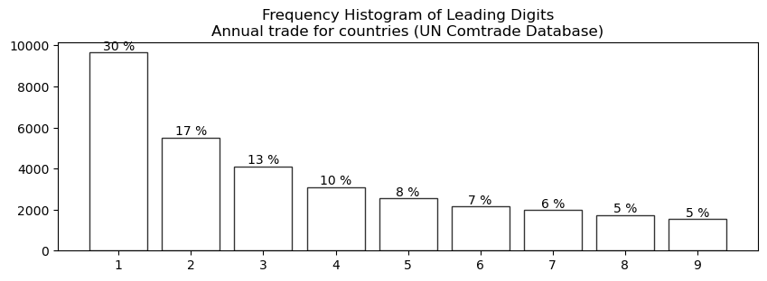
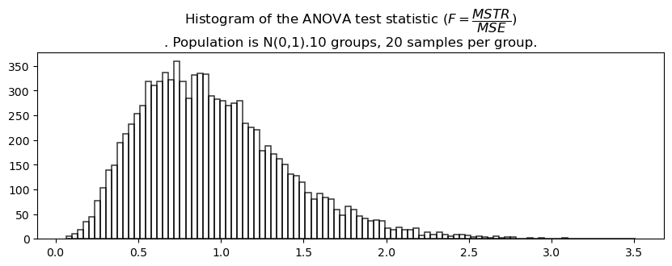
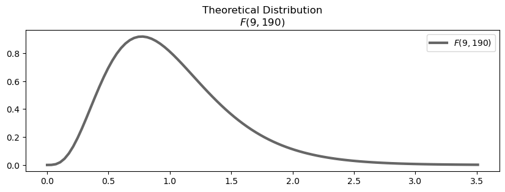
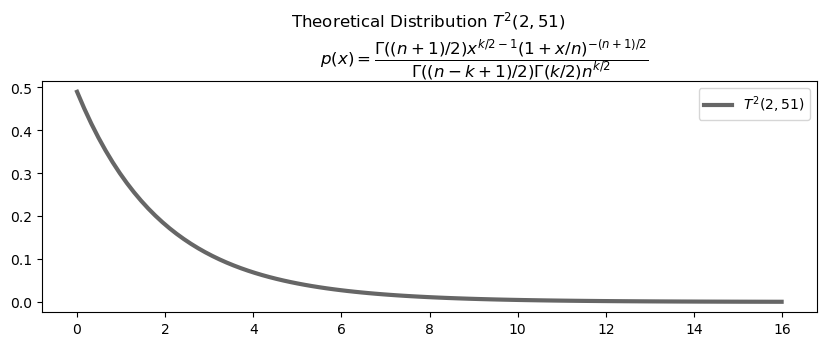

# Summary

This paper introduces a Monte Carlo-based educational toolkit for probability and statistics-related courses. 
We have published it as an open-sourced project to benefit a broad range of peer researchers and educators. The toolkit 
provides an empirical way to solve complex probability problems. It can intuitively illustrate the specific distribution 
that a particular experiment or test statistic follows. It contains three modules. (1) The “experiments” module provides 
simulations for classical numeric or probability problems, e.g., Buffon's needle puzzle and the locker problem. 
(2) The “distributions” module uses simulations to generate common distributions, e.g., Benford, Poisson, and Zipf. 
(3) The “samplings” module illustrates the sampling distributions of hypothesis test statistics, e.g., the chi-squared 
statistic in Pearson's GOF test and the F statistic in ANOVA. This toolkit provides an empirical and intuitive alternative 
to formal math proofs for complex probability problems. Until now, it has been used in higher education courses for three 
years and was positively reviewed by both peer educators and undergraduate students. In the next development milestone, 
we will (1) extend API to support more experiments and sampling distributions, and (2) provide a dedicated cross-platform 
desktop or web GUI (based on tk-inter or Flask) to make the toolkit more user-friendly.

# Statement of need

The Monte Carlo (MC) method is a powerful computer-simulated technique to study probability problems and complex systems. 
Based on LLN (Law of Large Numbers), MC can provide a convincing approximation for theoretical solutions, i.e., the observed 
frequency will asymptotically approach its theoretical probability($f \rightarrow p$). The early idea of using LLN can be 
traced back to the 18th century when French scientist Buffon proposed his famous needle problem. Since the 20th century, 
digital computers have made the MC method much more helpful and popular. MC has been used in many theoretical research 
and engineering domains, e.g., optics [@bib1; @bib2], radiation research [@bib3], nuclear physics [@bib4], medicine [@bib5], 
materials science [@bib6; @bib7], quality management [@bib8], supply chain [@bib9], software engineering [@bib10], etc.

As higher education teachers, we found the MC method a powerful and promising didactic tool. This paper introduces an 
MC-aided educational toolkit for probability and statistics-related courses and studies. The project was initiated in 
2019 and is now published as an open-source Python package(mc-tk). Highlights of the toolkit functionality include: 
(1) It provides an intuitive and versatile complement to theoretical math proofs. For example, it may be challenging to 
prove why the statistic used in a particular test follows a specific sampling distribution. Meanwhile, we can run MC 
simulations and plot the frequency histogram of the statistic to verify whether it is close to the theoretical distribution. 
This provides an easier and more intuitive alternative. (2) It includes historical and real-life experiments. For example, 
the package offers MC experiments for Buffon's needle problem, Galton board, the locker puzzle, Benford's law, etc. 
The rich case library has proved to be very helpful in statistical education. (3) Side-by-side visual comparison between 
empirical and theoretical distributions/results. (4) Flexible and tunable. The package follows the OOP (object-oriented 
programming) design allowing users to set many experiment-specific parameters in the derivative classes. This helps study 
asymptotic distributions or limits. For example, the locker puzzle allows users to increase the prisoner number and test 
its limit ( when $n\rightarrow\infty$ ). In the survival game experiment, users can set the per-round survival rate $p$ 
to a very low value to get the asymptotic exponential distribution. The CLT (central limit theorem) class allows users 
to change the underlying distribution (e.g., uniform, Bernoulli, exponential) and the sample size to verify the theorem.

Until now, the toolkit has been used in the probability and statistics course and was well received by teachers and students. 
The following manuscript will provide details on the software functionality.

# Overview

The following table provides an overview of the toolkit's API (application programming interface). The toolkit is organized into three 
modules. The first module offers simulations for solving classical numeric or probability problems, e.g., Buffon's needle 
problem, the locker puzzle, etc. The second module provides simulated experiments to generate simulations for commonly 
used distributions, e.g., a sudden death game that produces the exponential distribution and the paper clip experiment 
that generates the Zipf distribution. For each MC experiment, both the observed histogram and theoretical density function 
are provided for comparison. The third module illustrates the sampling distribution of popular hypothesis test statistics. 
e.g., the $\chi^{2}$ statistic in Pearson's chi-squared GOF test, ANOVA's F statistic, etc.

| Module | Class | Description |
|-------|---------|------------------------------|
| mc.experiments | Pi | Perform Buffon's needle experiment to estimate $\pi$. |
|                | Parcel | Simulate a bi-directional parcel passing game. |
|                | Dices | Estimate the probabilities of various dice combinations. |
|                | Prisoners | The famous locker puzzle(100-prisoner quiz). <br>The asymptotic_analysis() function will demonstrate that the survival chance limit is $1-\ln(2)$ when *n* approaches $+\infty$. |
|                | Galton_Board | Use the classic Galton board experiment to produce a binomial distribution. |
|                | Paper_Clips | Use the paper clip experiment to create a Zipf distribution. |
|                | Sudden_Death | This class simulates a sudden death game to make the exponential distribution. |
||
| mc.distributions | Poisson | This class will demonstrate that Poisson is a limit distribution of *b(n,p)* when *n* is large and *p* is small. |
|                  | Benford | Verify Benford's law using real-life datasets, including the stock market data, international trade data, and the Fibonacci series. |
||
| mc.experiments | Clt | Using various underlying distributions to verify the central limit theorem. This class provides the following underlying distributions: <br>“uniform” - a uniform distribution U(-1,1); <br>“expon” - an exponential distribution Expon(1); <br>“poisson” - Poisson distribution $\pi(1)$; <br>“coin” - Bernoulli distribution with $p = 0.5$; <br>“tampered_coin” - PMF:{0:0.2,1:0.8}, i.e., head more likely than tail; <br>“dice” - PMF:{1:1/6,2:1/6,3:1/6,4:1/6,5:1/6,6:1/6}; <br>“tampered_dice” - PMF: {1:0.1,2:0.1,3:0.1,4:0.1,5:0.1,6:0.5}, i.e., 6 is more likely. |
|                | T_Test | This class constructs an r.v. (random variable) following the t distribution. |
|                | Chisq_Gof_Test | Verify the statistic used in Pearson's Chi-Square Goodness-of-Fit test follows the $\chi^2$ distribution. |
|                | Fk_Test | Verify the Fligner-Killeen Test statistic(FK) follows the $\chi^2$ distribution. |
|                | Bartlett_Test | Verify that Bartlett's test statistic follows the $\chi^2$ distribution. |
|                | Anova | Verify the statistic of ANOVA follows the F distribution. |
|                | Kw_Test | Verify the Kruskal-Wallis test statistic (H) is a $\chi^2$ r.v. |
|                | Sign_Test | For the sign test (medium test), verify its N- and N+ statistics follow b(n,1/2). |
|                | Cochrane_Q_Test | Verify the statistic T in the Cochrane-Q test follows the $\chi^2$ distribution. |
|                | Median_Test | Verify the statistic MT in the Median test follows the $\chi^2$ distribution. |
|                | Hotelling_T2_Test | Verify the $T^2$ statistic from two multivariate Gaussian populations follows the Hotelling's $T^2$ distribution. |

# Illustrative Examples

This section will showcase some classes provided by the software.

## Classes for Classical MC Experiments

The "experiments" module provides MC simulation for classical probability problems, such as Buffon's needle experiment, the 
bi-directional game, the dice game, the locker puzzle, the Galton board experiment, the survival game, and the paper clip 
experiment. Here, we will demonstrate the locker puzzle.

### The Locker Puzzle

The "hundred-prisoner puzzle" or "the locker puzzle" was first addressed by Danish scientist Peter Bro Miltersen [@bib11; @bib12]. 
In this puzzle, there are 100 lockers containing No.1 to No.100. In each round, one prisoner will open 50 lockers. 
The game will continue if his/her number is found inside any of the opened lockers. Otherwise, the game is over, and all 
prisoners will be executed. The prisoners cannot communicate with each other during the game. What are the best strategy 
and the highest survival probability?

With no strategy (becomes a repeated Bernoulli experiment), the survival probability will be $(\frac{1}{2})^{100}$, which 
is virtually 0. According to the authors, the best strategy is the "circular chain," i.e., the prisoner first opens the 
locker of their number then opens the locker whose number is inside the last locker. With this strategy, the survival 
probability equals the probability of creating circular chains no longer than 50. This probability is: 
$p=1-\frac{1}{100!}\sum_{l=51}^{100}\left(\frac{1}{l}\times100!\right)=1-\sum_{l=51}^{100}\frac{1}{l}=1-0.688=0.312$.
Furthermore, if we increase the total prisoner number, we can prove that this probability will converge to $1-ln2$ (0.307).

The Prisoners class simulates this experiment, and users can get the survival chance plot against different prisoner 
numbers(\autoref{fig:1}).

``` {.python language="python"}
Prisoners(n=100,N=2000).run()
    # n : the number of prisoners.
    # N : how many MC experiments to run.
    result : p = 0.3116
```

``` {.python language="python"}
Prisoners.asymptotic_analysis(ns=[250,500,750,1000,1250,1500,1750,2000], 
                              repeat=10, SD=1,N = 1000)
    # ns : prisoner numbers to be tested.
    # repeat : repeat multiple times to calculate the SD (standard deviation).
    # SD : how many SD (standard deviation) to show in the error bar chart.
    # N : the number of MC experiments performed for each n.
```


## Classes for Common Distributions

The "distributions" module provides MC experiments to generate specific distributions (e.g., Poisson distribution and 
Benford distribution) and compare the observed MC results with the PDF/PMF of the theoretical distribution side-by-side. 
Here, we will demonstrate the Benford distribution.

### Benford Distribution

The Benford law, a.k.a. the Newcomb-Benford law or the first-digit law, describes the PMF of leading digits in many 
real-life financial and social data [@bib13]. In essence, the natural or social processes that follow the power laws 
(very common) often demonstrate this distribution. Financial audits often use it to check faked or manipulated data. The
Benford PMF is as follows.

|   leading digit   |    1     |    2     |    3     |    4    |    5    |     6   |    7    |    8    |    9    |
|:-----------------:|----------|----------|----------|---------|---------|---------|---------|---------|---------|
|        p          |   30.1%  |   17.6%  |   12.5%  |   9.7%  |   7.9%  |   6.7%  |   5.8%  |   5.1%  |   4.6%  |


The Benford class provides three examples to verify the Benford law (\autoref{fig:2}). The first example uses the 20-year trading 
volume data of AAPL (Apple Inc.). The second example uses the United Nations' international trading data. The last example 
uses the Fibonacci series.

``` {.python language="python"}
Benford(data='stock',N=1000).run()
    # data : data set to be used.
    #  'stock' - use 20-year stock trading volume data of Apple Inc. (AAPL)
    #  'trade' - use annual trade data from various countries. 
    #            https://comtrade.un.org/data/mbs
    #  'fibonacci' - use the top-N fibonacci series.    
    # N : how many MC experiments to run.
```

According to \autoref{fig:2}, all the examples fit well against the theoretical Benford distribution. We can use the Fibonacci 
series to explain the Benford law intuitively. The Fibonacci sequence represents how a population (e.g., rabbits) grows 
in a resource-unlimited environment. At a steady breeding speed, it takes much longer time to increase the population 
from 100 to 200 (need to increase by 100) than from 90 to 100 (only need to increase by 10). It also takes longer time 
than 200 to 300 because the population has grown bigger in the latter case. Therefore, it stays longer at smaller leading 
digits than the bigger ones.





## Classes for Sampling Distributions

The "samplings" module provides classes to verify the sampling of common hypothesis testing statistics, including the 
student's t test, Pearson's Chi-Squared Goodness-of-Fit(GOF) test, ANOVA(analysis of variance) test, the Kruskal-Wallis 
test, the Fligner-Killeen test, Bartlett's test, the sign test, the Cochran's Q test and the Hotelling's $T^2$ test. It also 
contains a class to demonstrate the Central Limit Theorem (CLT). In each class, we construct the test statistics and 
compare them with the theoretical sampling distributions. Here we present GOF test, ANOVA test and the Hotelling’s 
$T^2$ test as examples.

### Pearson's Chi-Square Goodness-of-Fit Test

Pearson's Chi-Square Goodness-of-Fit (GOF) test uses the following statistic. 
    $$\chi^2=\sum_{j=1}^{k}\frac{(f_{j}-np_{j})^2}{np_{j}} \sim \chi^2(k-1)$$  
When $n$ is large enough ($n \geq 50$), $\chi^2$ will follow the $\chi^2(k-1)$ distribution. As Pearson's chi-square 
GOF test is non-parametric, there is no restriction on the population distribution. The Chisq_Gof_Test class provides 
two population distributions. (1) The first is the Galton board (use the binominal population, \autoref{fig:3}). (2) The second 
is the dice game (use the uniform PMF, \autoref{fig:4}). In both cases, the statistic histogram from the MC experiment is very close
to the theoretical $\chi^2(k-1)$ distribution.

``` {.python language="python"}
Chisq_Gof_Stat(underlying_dist='binom',k=8,sample_size=100,N=10000).run()
    # underlying_dist : what kind of population dist to use. By default, 
    #                   we use binom, i.e., the Galton board.
    #   'binom'/'galton' - the population is binom.
    #   'dice' - 6 * 1/6.
    # k : classes in the PMF.
    # N : how many MC experiments to run.
```


### ANOVA

ANOVA (analysis of variance) is a parametric mean test for multiple groups. Its null hypothesis 
$H_{0}$ is: $\mu_{1}=\mu_{2}=...=\mu_{k}$. ANOVA constructs the test statistic by splitting the total variance into 
treatment (between-class difference, MSTR) and noise (within-class variance, MSE). When $H_{0}$ is true, the ratio of 
MSTR and MSE will follow the F distribution, i.e., $F=\frac{MSTR}{MSE} \sim F(k-1,n-1)$.

The Anova class will calculate the histogram of the F statistic observed from a multi-group normal sample (\autoref{fig:5}).

``` {.python language="python"}
Anova(k=10,n=10,N=10000).run()
    # k : the number of classes/groups.
    # n : the sample size in each class/group. The total sample size is [k]*[n].
    # N : how many MC experiments to run.
```





### Hotelling's $T^2$ Test

The Hotelling's $T^2$ test compares the mean of two multivariate populations. Suppose we have two groups of samples from
$N(\mu_{1},\sum)$ and $N(\mu_{2},\sum)$. They share the same covariance matrix $\sum$. The null hypothesis is 
$H_{0}: \mu_{1}=\mu_{2}$ and the test statistic is: 
$$T^2=n(\overline{x}-\mu)^{T}S^{-1}(\overline{x}-\mu)$$    
$S=\frac{1}{n-1}\sum_{i=1}^{n}(x_{i}-\overline{x})(x_{i}-\overline{x})^T$ is the grand covariance matrix.

If the dimensionality $k = 1$, Hotelling's $T^2$ degenerates into the t distribution. When $k \geq 2$, it is a multivariate 
generalization of the t distribution. The Hotelling_T2_Test class verifies the $T^2$ sampling distribution (\autoref{fig:6}).

``` {.python language="python"}
Hotelling_T2_Test(n=50,k=2,N=1000).run()
    # n : the sample size in each class.
    # k : data dimension.
    # N : how many MC experiments to run.
```




# Acknowledgment

This work was supported by National Natural Science Foundation of China (62376249) and Ministry of Science and Technology 
of the People's Republic of China (2023YFD1000400).

# Data Availability Statement

The source code is hosted on GitHub: https://github.com/zhangys11/mc.  
License: Apache License 2.0  
The CodeOcean reproducible Capsule is published at: https://doi.org/10.24433/CO.4921884.v2.

# References
